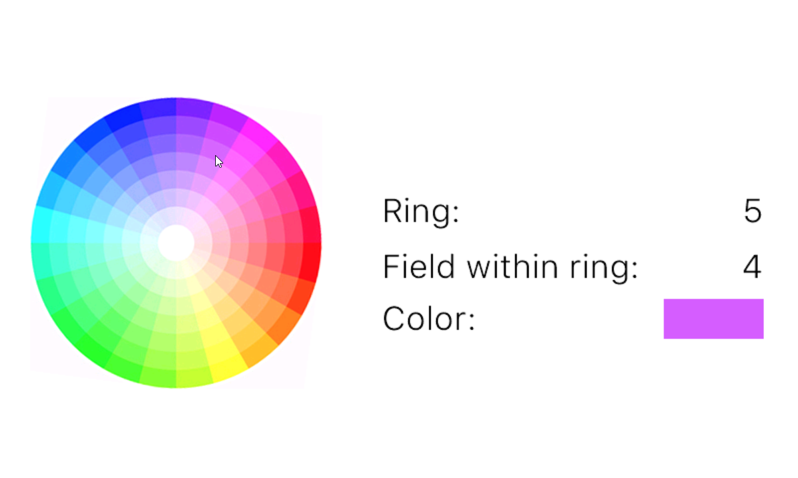

# Circular Color Picker for Nextion

... including a code generator.



## Description

### General

This project implements a circular color picker on Nextion. Usually you'd need trigonometric functions for this (which Nextion doesn't allow you to use unless you implement them yourself). This project however circumvents them. The "cost" is that you cannot have a continuous color wheel but only one with discrete color fields. Still pretty cool. 

### The Code (Generator)

The code generator works as command line tool. You provide it the properties of your color wheel (size, number of colors, ... - see [Usage](#usage) below) and it generates the corresponding Nextion code. 

The generated code only converts touch presses to polar coordinates or in simple terms: the color `ring` and the color `field` within that ring. It is up to you how you convert these values into an actual color. I can think of the following options:

* Use my hsv2rgb code from my rectangular HSV color picker. In most cases color wheels give you h (hue) and s (saturation) while fixing v (value) at maximum. See the [demo project](#the-nextion-project).
* Have a long (maybe auto-generated) if-else chain that determines the color
* Use an array. Nextion doesn't allow users to define their own arrays so you need to be creative.
	* One option is to use a string (yes this is no joke). It is of course a pretty slow solution but at least it doesn't consume any user RAM. In pseudo code:
		```
		s = "light_red,light_green,light_blue;red,green,blue;dark_red,dark_green,dark_blue"
		// Split by ring and select the right one
		s = s.split(";")[ring.val]
		// Split by color within the ring and select final color field
		s = s.split(",")[field.val]
		color = int(s)
		```
	* The other option is to save the values in variables on the page. These can then be accessed using the page's component array `b[id]`. For let's say a color wheel with 4 rings and 12 colors each you'd have to create 48 variables (tip: use copy paste to get 1, 2, 4, 8, ... variables quickly). Assuming the first one is named `va0` the code would look somewhat like the following. The downside is obviously the RAM consumption. 
		```
		// calculate array index. Assuming the color fields are 
		// numerated ring by ring. Colors per ring: 12
		sys0=ring.val*12
		sys0+=field.val
		// add offset since the beginning of the array is not at
		// id = 0 (0 is always the id of the page itself)
		sys0+=va0.id
		color.val=b[sys0].val
		```

### The Nextion Project

The Nextion HMI file of this project contains a fully working demo with a color wheel having 8 rings and 24 fields per ring (definitely nothing you'd want to code by hand). The touch press code of the color wheel picture component contains the auto-generated code, determining the `ring` and `field` values. The touch release event adjusts those values such that they can be processed by the hsv2rgb code. That code has been directly copied from the [Nextion HSV Demo](/Nextion%20HSV%20Test/) project.

## Usage

### Code Generator

The [code generator](CircularColorPickerCodeGenerator.py) has been written in python 3.9. No additional modules required. You can run the script from the command line using 
```python CircularColorPickerCodeGenerator.py --help```
The integrated help should explain all required arguments. Don't worry, only a few properties of your desired color wheel are required.

For those who don't want to run a python script I included a [compiled version for windows](CircularColorPickerCodeGenerator.exe). Works the same way:
```CircularColorPickerCodeGenerator.exe --help```

You can choose if you want the code printed to the console or saved as (text) file. 

### Color Wheel

The code uses some tricks to determine the color field. One of them requires that the number of colors per ring is a multiple of 4. It's also necessary that the horizontal axis lines up with one of the borders between color fields. 

Bad (color field is _on_ the horizontal axis):


Good (horizontal axis is between the color fields):

