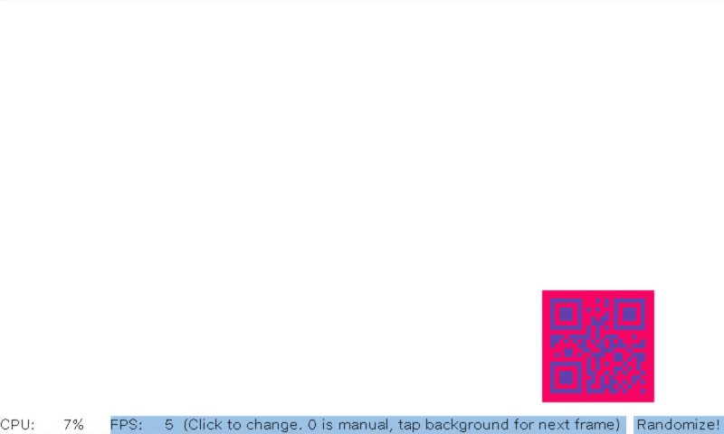

# Nextion FIS QR Code Demo

This is yet another Nextion related demo. It demonstrates the `qrcode` command that's included in Nextions capabilities but for some reason hidden from the users. It also demonstrates the CPU load (also available but hidden in the official instruction set). There are other, hidden commands. You can read about them here in the _Full_ instruction set document: https://github.com/UNUF/nxt-doc/blob/main/Protocols/Full%20Instruction%20Set.md#readme

As always, this folder contains the HMI file that you can open in the Editor and the Text form. 

